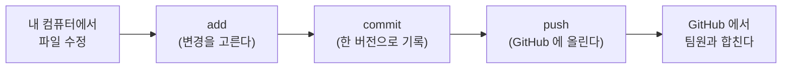
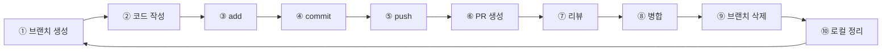

# 협업 가이드 (초급 팀 프로젝트)

> 팀원 전원용. Git·GitHub 을 한 번도 안 써봤어도 이 문서 하나로 시작할 수 있게, 개념부터 실전까지 순서대로 담았습니다.
> 혼자 실습하며 읽으세요. 막히면 **부록 B(오류 사전)** 부터 봅니다.

## 읽는 순서

| 부분 | 내용 | 언제 |
| --- | --- | --- |
| **1. 개념** | Git ≠ GitHub, 딱 3개 개념 | 시작 전 5분 |
| **2. 준비** | 설치·계정·환경 (한 번만) | 첫날 |
| **3. 첫걸음** | 아주 작게 한 번 해보기 (3가지 방법) | 첫날 |
| **4. 작업 사이클** | 매 작업마다 반복하는 10단계 | 매일 |
| **5. 충돌 해결** | 코드가 겹쳤을 때 | 필요할 때 |
| **6. 팀 규칙** | 브랜치·커밋·PR·담당·금지 | 시작 전 정독 |
| **7~8. 더 쓰기** | GitHub 기능·GUI 툴 | 익숙해진 뒤 |
| **부록** | 명령어·오류·용어·Fork·체크리스트 | 수시로 |

---

## 1. 먼저 이해하기

### Git 과 GitHub 의 차이

| | 무엇 | 비유 |
| --- | --- | --- |
| **Git** | 내 컴퓨터에서 파일의 변경 이력을 저장하는 도구 | 무한 되돌리기가 되는 세이브 버튼 |
| **GitHub** | 그 이력을 인터넷에 올려 팀원과 공유하는 사이트 | 구글 드라이브 + 댓글·리뷰 기능 |

**왜 쓰나** — 같은 파일을 둘이 고쳐도 안 덮어쓰게 합쳐주고, 잘 돌던 시점으로 되돌릴 수 있고, 누가 언제 뭘 바꿨는지 다 남습니다.

### 큰 그림 (이 순서가 전부)



### 딱 3개 개념만

| 개념 | 한 줄 |
| --- | --- |
| **저장소 (repository / 레포)** | 프로젝트 폴더 하나 + 그 안 모든 변경 이력 |
| **커밋 (commit)** | "여기까지를 한 번으로 저장" + 짧은 메모(메시지) |
| **브랜치 (branch)** | 나만의 작업 갈래. 남 것과 안 섞이고 따로 개발하다 나중에 합침. `main` 은 팀의 정답 |

> 나머지 용어(push·pull·merge·PR …)는 하다 보면 익혀집니다. 헷갈리면 **부록 C**.

---

## 2. 준비 — 한 번만

### 2-1. 설치

| 프로그램 | 받는 곳 | 비고 |
| --- | --- | --- |
| **Git** | Windows <https://git-scm.com/download/win> · macOS 터미널에서 `git --version` | Windows 는 설치 후 **Git Bash** 사용 (일반 `cmd` 아님) |
| **VS Code** | <https://code.visualstudio.com> | 코드 편집·충돌 해결·Git 화면 |
| (선택) **GitHub Desktop** | <https://desktop.github.com> | 터미널이 무서우면 버튼으로 |
| **conda (Miniforge)** | <https://github.com/conda-forge/miniforge> | 개발 환경용 |

> ✅ **확인** — `git --version` → `git version 2.xx.x` 가 나오면 성공.

### 2-2. GitHub 계정 · 초대 수락

1. <https://github.com> 가입 (username 은 공개되니 단정하게)
2. 내 **GitHub 아이디**를 팀장에게 전달
3. 팀장의 초대를 이메일 또는 `github.com/notifications` 에서 **Accept**

> ⚠️ 초대를 수락하지 않으면 나중에 `git push` 에서 `Permission denied` 가 납니다.

### 2-3. Git 최초 설정

커밋에 작성자가 기록되므로 이름·이메일을 먼저 등록합니다.

```bash
git config --global user.name "본인 이름"
git config --global user.email "GitHub 이메일"
git config --global core.autocrlf input   # macOS  (Windows 는 true)
```

> ✅ **확인** — `git config --list` 에 `user.name`, `user.email` 이 보이면 됩니다.

### 2-4. 저장소 받기 + 개발 환경

```bash
git clone https://github.com/rinaking/beginner-team-project.git
cd beginner-team-project
conda env create -f environment.yml
conda activate beginner-team-project
```

> ✅ **확인** — 프롬프트 앞에 `(beginner-team-project)` 가 붙고, `git status` 가 `working tree clean` 이면 준비 끝.

---

## 3. 첫걸음 — 아주 작게 한 번

> 세 가지 방법 중 **하나만** 골라 해보세요. 익숙해지면 방법 C(터미널)로 옮깁니다.

### 방법 A — GitHub 웹에서만 (터미널 0)

1. 팀 저장소에서 아무 문서(`README.md` 등) 클릭 → 오른쪽 위 **연필(Edit this file)**
2. 한 줄 고침 → 오른쪽 위 **Commit changes…**
3. **"Create a new branch… and start a pull request"** 선택 → 브랜치명 입력 → **Propose changes**
4. 다음 화면에서 **Create pull request**

### 방법 B — GitHub Desktop (버튼)

1. **File → Clone repository** → 팀 저장소 → **Clone**
2. **Current Branch → New Branch** → `feature/연습-내이름`
3. VS Code 로 몇 글자 수정·저장
4. **Summary** 칸에 `feat: 연습 커밋` → **Commit to feature/…** → **Push origin**
5. 뜨는 **Create Pull Request** 클릭

### 방법 C — 터미널

```bash
git switch -c feature/연습-내이름
# 파일 몇 글자 수정·저장 후
git add .
git commit -m "feat: 연습 커밋"
git push -u origin feature/연습-내이름
```

터미널에 뜨는 `pull/new/...` 링크 클릭 → **Create pull request**.

> 방금 한 것을 말로 풀면: `clone`(내 컴퓨터로 복사) → `브랜치 생성`(내 갈래에서 작업) → `add`+`commit`(변경을 골라 한 버전으로) → `push`(GitHub 에 올림) → `PR`(합쳐달라는 요청 + 리뷰).

---

## 4. 작업 사이클 — 매번 반복



### ① 내 브랜치 만들기

`main` 은 팀 공용이라 작업은 항상 내 브랜치에서.

```bash
git switch main
git pull origin main
git switch -c feature/로그인-폼
```

> 💡 `git switch -c` = 브랜치 생성 + 이동 (옛 방식 `git checkout -b` 와 같음).
> ✅ **확인** — `git branch` 에서 `* feature/로그인-폼` 에 별표.

### ② 코드 작성

**내가 맡은 파일·폴더 안에서만** 작업합니다. (담당은 6-4)

### ③ 무엇이 바뀌었는지 보기

```bash
git status        # 바뀐 파일 목록
git diff          # 바뀐 줄 내용
```

### ④ 스테이징 (add)

바꾼 것 중 **커밋에 담을 것**을 고릅니다.

```bash
git add .                 # 전부
git add src/login.py      # 특정 파일만
```

> ⚠️ `.env`·데이터·모델 파일은 add 하지 않습니다.

### ⑤ 커밋 (commit)

```bash
git commit -m "feat: 로그인 폼 유효성 검사 추가"
```

메시지 형식은 6-2.

### ⑥ 원격에 올리기 (push)

```bash
git push -u origin feature/로그인-폼   # 첫 push
git push                              # 이후
```

> ⚠️ `git push origin main` (main 직접 push) 은 금지·차단됩니다.

### ⑦ PR 만들기

1. GitHub 저장소 → 노란 배너 **Compare & pull request** (없으면 **Pull requests → New pull request**)
2. 방향: **base `main` ← compare `feature/로그인-폼`**
3. 제목은 커밋과 같은 형식
4. 본문에 **작업 내용 / 구현 기능 / 테스트 결과**
5. **Reviewers** 에 팀원 1명 이상
6. **Create pull request**

### ⑧ 리뷰

**받았을 때** (24시간 내): **Files changed** 탭에서 코드 읽기 → 줄 옆 **+** 로 코멘트 → 괜찮으면 **Review changes → Approve**.

**내 PR에 지적이 왔을 때**: 같은 브랜치에서 다시 ③④⑤ → PR 자동 갱신 (새 커밋 시 이전 승인 무효).

### ⑨ 병합

**승인 1개 + 검사 통과 + 대화 해결** → 초록 버튼 옆 화살표 **Squash and merge** → **Confirm** → **Delete branch**.

### ⑩ 로컬 정리

```bash
git switch main
git pull origin main
git branch -d feature/로그인-폼
```

→ 다음 작업은 다시 ① 부터.

---

## 5. 충돌(conflict) 해결

### 언제 생기나

두 사람이 **같은 파일의 겹치는 줄**을 다르게 고친 뒤 합칠 때. 잘못이 아니라 협업에서 자연스러운 일입니다.

### 그림으로 이해하기 — 병합의 두 가지

**경우 1. Fast-forward (충돌 없음)** — 분기 이후 `main` 에 새 커밋이 하나도 없었을 때. `main` 이 그냥 앞으로 따라옵니다.

```text
① 분기 시점
main          A ─ B
                   └─ C ─ D      feature/profile  (프로필 기능 작업)

② main 에 추가된 커밋이 없음 → git merge 시 Fast-forward
   git switch main
   git merge feature/profile

③ 결과 — 병합 커밋 없이 직선 이력
main          A ─ B ─ C ─ D
```

**경우 2. 3-way merge + 충돌 (양쪽이 각자 진행)** — 분기 이후 `main` 도, 내 브랜치도 각자 커밋했고, 그중 같은 파일 같은 줄이 겹칠 때.

```text
① 분기 후 양쪽이 각자 커밋
main          A ─ B ─ C ─ D          ← main 에서도 같은 줄 수정 (D)
                   └─ X ─ Y          feature/ui-fix  ← 같은 줄을 다르게 수정 (Y)

② git switch main → git merge feature/ui-fix
   → CONFLICT: D 와 Y 가 같은 줄을 다르게 고침 → Git 이 못 정함

③ 사람이 충돌 구간을 정리하고 커밋 → 병합 커밋 M 이 생김
main          A ─ B ─ C ─ D ─ M
                   └─ X ─ Y ──┘
```

> 💡 우리 팀은 브랜치에서 먼저 `git merge origin/main` 으로 **경우 2를 내 브랜치에서 해결**한 뒤 PR 을 올립니다 (아래 절차). 그러면 `main` 병합은 깔끔하게 끝납니다.

### PR에 "This branch has conflicts" 가 뜨면

1. 내 브랜치에서 main 최신을 합칩니다.

   ```bash
   git switch feature/로그인-폼
   git fetch origin
   git merge origin/main
   ```

2. 충돌 파일을 VS Code 로 열면:

   ```text
   <<<<<<< HEAD
   내 브랜치 내용
   =======
   main 쪽 내용
   >>>>>>> origin/main
   ```

3. **최종적으로 맞는 코드만 남기고** `<<<<<<<` `=======` `>>>>>>>` 세 줄을 지웁니다.
   (VS Code 버튼: Accept Current / Incoming / Both)

4. 마무리:

   ```bash
   git add <해결한 파일>
   git commit
   git push
   ```

> ⚠️ 애매하면 **남의 코드를 임의로 지우지 말고** 관련 팀원과 먼저 얘기하세요.
> 💡 되돌리려면 `git merge --abort`. 커밋 전 파일 되돌리기는 `git restore <파일>`.

### 예방

- 담당 파일을 겹치지 않게 나눈다
- 작업 전 항상 `git pull origin main`
- 브랜치를 오래 방치하지 않는다 (하루 이틀 안에 PR)

---

## 6. 팀 규칙

### 6-1. 브랜치 전략 — GitHub Flow

- `main` : 항상 정상 동작. PR 병합으로만 변경. 직접 push 금지.
- `feature/<요약>` : `main` 에서 분기 → 작업 → PR → 병합 후 삭제.
- 접두: `feature/` `fix/` `docs/` `refactor/` `test/` `chore/` + 소문자-하이픈.

### 6-2. 커밋 규칙

`<타입>: <무엇을 왜, 명령형, 72자 이내>` — 예: `feat: CSV 로더에 결측치 보간 추가`

| 타입 | 쓸 때 |
| --- | --- |
| `feat` / `fix` | 기능 / 버그 |
| `docs` / `test` | 문서 / 테스트 |
| `refactor` / `chore` | 정리 / 잡일 |

커밋은 **의미 단위로 자주**. 하루치를 한 커밋에 몰지 않습니다.

### 6-3. PR·병합 규칙

- PR 본문: 작업 내용 · 구현 기능 · 테스트 결과
- 리뷰어 1명 이상 · 리뷰 요청은 24시간 내 응답
- **승인 1개 + 검사 통과 → Squash and merge → Delete branch**
- 본인 PR은 본인이 승인 불가

### 6-4. 담당 분리

> 👉 루트 [README 의 "팀" 표](../README.md#-팀) 에 각자 자기 행을 추가해 채웁니다.
> 담당 파일·폴더가 서로 겹치지 않게 (겹치면 충돌).
> 수정이 안 되면 → 팀장에게 문의 (Collaborator Write 권한 필요).

### 6-5. 절대 금지

- ❌ `main` 직접 커밋·push
- ❌ `git push --force`
- ❌ 리뷰 승인 없이 병합
- ❌ 남의 담당 파일을 상의 없이 크게 수정
- ❌ 대용량 파일(데이터·모델·빌드 산출물) 커밋 → `.gitignore`
- ❌ 비밀 값 커밋 → `.env` 는 커밋 금지, 키 이름만 `.env.example`

### 6-6. 일정 (팀장 작성)

| 항목 | 내용 |
| --- | --- |
| 스프린트 기간 | _(작성)_ |
| 데일리 체크인 | _(작성)_ |
| 중간 점검 | _(작성)_ |
| 코드 프리즈 | _(작성 — 이후 `fix` 만)_ |
| 발표 | _(작성)_ |

---

## 7. GitHub 기능 더 쓰기 (익숙해진 뒤)

### 7-1. README 와 마크다운

저장소 첫 인상. 권장 구조: `# 프로젝트명` → 개요 → 폴더 구조 → 실행 방법 → 결과 → 팀원 및 역할.

| 문법 | 결과 |
| --- | --- |
| `# ## ###` | 제목 |
| `- 항목` / `1. 항목` | 목록 |
| `- [ ]` / `- [x]` | 체크박스 |
| `` `코드` `` / 백틱 3개 블록 | 인라인/블록 코드 |
| `[보이는글](URL)` / `` | 링크 / 이미지 |
| `> 글` | 인용문 |

### 7-2. Issues (할 일 · 버그 추적)

**Issues → New issue** → 제목·본문(`- [ ]` 체크리스트 유용) → 오른쪽 패널의 **Assignees / Labels(`bug` `feature` `blocked`) / Milestone**.
PR 본문에 `Closes #12` 를 적으면 병합 시 그 이슈가 자동으로 닫힙니다.

### 7-3. Pull Request 깊게

| 기능 | 설명 |
| --- | --- |
| **Draft PR** | 아직 리뷰 단계 아님. 준비되면 **Ready for review** |
| **Files changed** | 줄 옆 `+` 로 코멘트, 여러 줄은 드래그 |
| **Suggestion** | 코멘트창 `±` 아이콘 → 고칠 코드 직접 제안. 상대가 버튼으로 반영 |
| **Review changes** | `Comment` / `Approve` / `Request changes` |
| **Resolve conversation** | 반영된 코멘트 스레드 접기 (병합 조건) |
| **Re-request review** | 리뷰어 이름 옆 순환 아이콘으로 다시 요청 |
| **Update branch** | 보이면 누름 — `main` 최신을 내 브랜치에 반영 |

### 7-4. 코드 리뷰 잘하기

- 정확성 → 엣지 케이스 → 테스트 유무 순으로 본다
- "이거 이상해요" 보다 "여기서 X면 Y 되니 Z로 바꾸면 어떨까요"
- 취향(대문자·띄어쓰기)은 도구(ruff 등)에 맡기고 로직에 집중
- 칭찬도 남긴다

### 7-5. Projects (칸반 보드)

**Projects → New project → Board** → 컬럼 `Todo` / `In progress` / `In review` / `Done` → 이슈·PR 을 카드로. **Workflows** 로 PR 열림→In progress, 병합→Done 자동화.

### 7-6. Actions (자동 검사 / CI)

`.github/workflows/*.yml` 이 있으면 커밋·PR 마다 자동 실행. 결과는 **Actions** 탭 — 녹색 체크 통과, 빨간 X 실패. 빨간 X 클릭 → 실패 step 로그 → 로컬 재현·수정. 하단 **Re-run jobs** 로 재시도.

### 7-7. Releases & Tags

**Releases → Draft a new release** → **Choose a tag** 새 태그명(`v1.0`) → 릴리스 노트(**Generate release notes** 로 초안) → **Publish release**.

### 7-8. 단축키

| 키 / 위치 | 기능 |
| --- | --- |
| `t` | 파일 빠르게 찾기 |
| `.` (메인페이지) | 웹 에디터(github.dev) |
| `w` | 브랜치 전환 |
| **Insights** 탭 | 기여자·활동 |

---

## 8. GUI 툴 (터미널 대신)

| 툴 | 쓰는 이유 |
| --- | --- |
| **VS Code — 소스 제어 패널** (왼쪽 가지 아이콘) | 변경 확인 → `+` 스테이징 → 메시지 입력 → 체크모양 커밋 → `…` → Push |
| **VS Code — Git Graph 확장** | 브랜치·커밋 그래프를 눈으로 보며 이해 |
| **GitHub Desktop** | Clone / Branch / Commit / Push / PR 생성을 버튼으로 |
| **VS Code — 충돌 편집기** | 충돌 구간에 Accept Current / Incoming / Both 버튼 |

> GUI 로 해도 내부에선 똑같은 Git 명령이 실행됩니다.

---

## 부록 A. 명령어 한눈에

### 기본 흐름

| 상황 | 명령 |
| --- | --- |
| 저장소 받기 | `git clone <URL>` |
| 최신화 | `git switch main && git pull origin main` |
| 브랜치 생성 | `git switch -c feature/x` |
| 상태·차이 | `git status` · `git diff` · `git diff --staged` |
| 스테이징·커밋 | `git add .` · `git commit -m "feat: ..."` |
| 첫 push / 이후 | `git push -u origin feature/x` · `git push` |
| PR 생성(CLI) | `gh pr create --fill --web` |
| 병합 끝난 브랜치 삭제 | `git branch -d feature/x` |
| 이력 그래프 | `git log --oneline --graph --all` |

### 되돌리기

| 상황 | 명령 |
| --- | --- |
| 커밋 전 파일 되돌리기 | `git restore <파일>` |
| 진행 중 병합 취소 | `git merge --abort` |
| 방금 커밋 메시지만 수정 (push 전) | `git commit --amend -m "새 메시지"` |
| 최근 커밋 취소, 변경은 유지 | `git reset --soft HEAD^` |
| 이미 push한 커밋 되돌림 (공유 브랜치) | `git revert <해시>` |
| 잠깐 치우기 / 꺼내기 | `git stash` / `git stash pop` |

> 핵심: **내게만 있는 커밋 = `reset` OK. 남이 이미 받은 커밋 = `revert`.**

### 태그 · 원격

| 상황 | 명령 |
| --- | --- |
| 태그 생성 / push | `git tag -a v1.0 -m "첫 릴리스"` · `git push origin v1.0` (`--tags` 전부) |
| 원격 확인 / 주소 교체 | `git remote -v` · `git remote set-url origin <URL>` |
| 내려받기만 (병합 X) | `git fetch origin` |

---

## 부록 B. 자주 나는 오류

| 메시지 | 해결 |
| --- | --- |
| `git: command not found` | Git 설치 안 됨 / 터미널을 새로 안 열음 → 새 창에서 다시 |
| `Permission denied` / `403` | 저장소 초대 수락 확인, 권한 Write 확인 |
| `Updates were rejected ...` | `git pull origin <브랜치>` 후 다시 push |
| `not a git repository` | `cd <저장소 폴더>` 후 다시 |
| `local changes would be overwritten` | `git add` + `commit`, 또는 `git stash` |
| `CONFLICT (content) ...` | 위 **5. 충돌 해결** |
| `detached HEAD` | `git switch -c <새브랜치>` 로 빠져나오기 |
| `nothing to commit, working tree clean` | 오류 아님. 파일을 저장했는지 확인 |
| PR 병합 버튼 회색 | 승인 부족 / 검사 미통과 / 대화 미해결 / 브랜치 뒤처짐 |
| 비밀번호를 물어보는데 안 들어감 | GitHub 는 토큰 사용. 웹 팝업에서 로그인, 안 뜨면 팀장에게 토큰 설정 도움 요청 |

---

## 부록 C. 용어 사전

| 용어 | 뜻 |
| --- | --- |
| 레포 / 저장소 | 프로젝트 폴더 + 이력 |
| 로컬 / 원격 | 내 컴퓨터 / GitHub |
| 커밋 | 변경 한 번분을 메시지와 함께 기록 |
| 브랜치 | 작업 갈래. `main` 은 팀의 정답 |
| `origin` | clone 하면 자동으로 붙는 "GitHub 의 그 저장소" 별명 |
| `HEAD` | 지금 보고 있는 커밋을 가리키는 포인터 |
| 스테이징 영역(index) | 다음 커밋에 담을 변경을 모으는 곳. `git add` 로 넣음 |
| push / pull / fetch | 올리기 / 내려받기+병합 / 내려받기만 |
| PR | 합쳐달라는 요청 + 리뷰 |
| Fast-forward | 갈라진 이력이 없어 포인터만 앞으로 (깔끔) |
| 3-way merge | 서로 다른 갈래를 병합 커밋으로 합침 (충돌 가능) |
| Squash and merge | PR 의 여러 커밋을 하나로 합쳐 `main` 에 (우리 팀 표준) |
| 충돌(conflict) | 같은 줄을 둘이 다르게 고쳐 자동으로 못 합칠 때 |
| CI | 커밋·PR 마다 자동으로 lint·테스트 실행 (GitHub Actions) |

---

## 부록 D. 온보딩 체크리스트

- [ ] 1~6 정독
- [ ] `git --version` 확인
- [ ] GitHub 가입 + 아이디 전달 + 초대 수락
- [ ] `git config` 3줄 설정
- [ ] `git clone` + `conda env create` 완료
- [ ] 루트 README "팀" 표에 내 행 추가 (이름·역할·담당·브랜치 접두)
- [ ] 연습: `feature/연습-내이름` 으로 3장 또는 4장의 ①~⑩ 1회 완주
- [ ] 팀 커뮤니케이션 채널 참여

---

## 부록 E. Fork (외부 기여·오픈소스용)

우리 팀은 Collaborator 로 초대되므로 평소엔 Fork 가 필요 없습니다. 다만 **권한이 없는 외부 저장소에 기여**할 때는 Fork 를 씁니다.

| | Clone | Fork |
| --- | --- | --- |
| 대상 | 내가 권한 있는 저장소 | 권한 없는 원본 |
| 결과 | 로컬 복사본 | 내 계정에 독립 저장소 생성 |
| 반영 | 직접 push | PR 로만 |

**Fork 기반 기여 절차**

1. 원본 저장소 페이지에서 오른위 **Fork** 버튼 → 내 계정으로 복사
2. 내 Fork 를 clone 하고, 원본을 `upstream` 으로 등록:

   ```bash
   git clone https://github.com/<나>/<repo>.git
   cd <repo>
   git remote add upstream https://github.com/<원본계정>/<repo>.git
   ```

3. 원본 최신화는 주기적으로:

   ```bash
   git fetch upstream
   git switch -c feature/x upstream/main
   ```

4. 작업 → 내 Fork 에 push → 원본의 `main` 으로 PR 생성. 원본 유지자가 리뷰 후 병합 결정.

---

## 부록 F. 강의에서 더 다룬 명령

| 명령 | 뜻 |
| --- | --- |
| `git branch -r` | 원격 브랜치 목록 (fetch 후 상태 확인) |
| `git branch -a` | 로컬 + 원격 전부 |
| `git merge origin/<브랜치>` | fetch 후 원격 변경을 수동으로 병합 (`pull` = `fetch` + 이것) |
| `git branch -m <새이름>` | 현재 브랜치 이름 변경 |
| `git rm --cached <파일>` | 이미 추적 중인 파일을 추적에서 제외 (`.gitignore` 에 뒤늦게 추가했을 때) |
| `git remote rename old new` / `git remote remove <이름>` | 원격 이름 변경 / 삭제 |
| `git commit --amend` | 방금 커밋 수정 (push 전에만) |

### Git Flow 전체 브랜치 (참고 — 우리 팀은 GitHub Flow 사용)

| 브랜치 | 용도 |
| --- | --- |
| `main` | 최종 릴리스 버전. 태그 생성 |
| `develop` | 다음 릴리스 통합 브랜치 |
| `feature/*` | 기능 개발 → `develop` 으로 |
| `release/*` | 릴리스 직전 QA·버그수정 |
| `hotfix/*` | 배포본 긴급 수정 → `main` 과 `develop` 에 반영 |

---

> 규칙 변경은 팀 논의 후 반영합니다.
> 팀장용 운영 메뉴얼 → [팀장-가이드.md](팀장-가이드.md) · 완전 초보 → [github-처음-안내.md](github-처음-안내.md) · Git/GitHub 상세 → [github-활용-지침서.md](github-활용-지침서.md)
